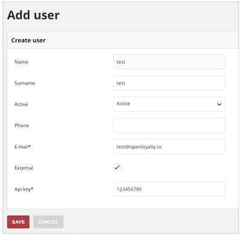

OpenLoyalty API auth
--------------------
There are two authorization mechanisms:

- JWT token
- permanent API token

Token JWT
---------
This mechanism is used by front-end applications, e.g. admin panel.

Obtaining JWT token
===================
To receive a token you need to POST data (_username and _password) to the /api/<user_type>/login_check

- _username - user login is his email or email/loyalty card number/phone in case of customer.
- _password - password
- <user_type> can be admin/customer/seller

.. code::

    curl 'http://openloyalty/api/admin/login_check' -H 'Content-Type: application/
    json;charset=UTF-8' -H 'Accept: application/json, text/plain, */*' --data-binary
    '{"_username":"admin","_password":"open"}'

API will return similar response:

.. code::

    {
        "token":"eyJhbGciOiJSUzI1NiIsInR5cCI6...",
        "refresh_token":"0558f8bb29948c4e54c443f..."
    }

Using JWT token
===============
Simply add Authorization header to each request to authorize it.

.. code::

    Authorization: Bearer JWT_TOKEN_HERE

Permanent token
---------------
Go to users management in administration panel and add new user (or edit existing one).

Mark ``external`` checkbox and provide api key.

This key can be used to authorize user in api.
It can be send via header

.. code::

    X-AUTH-TOKEN: 123456

or via query parameter

.. code::

    /api/campaigns?auth_token=123456